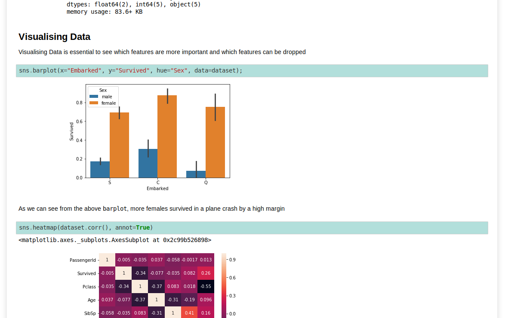
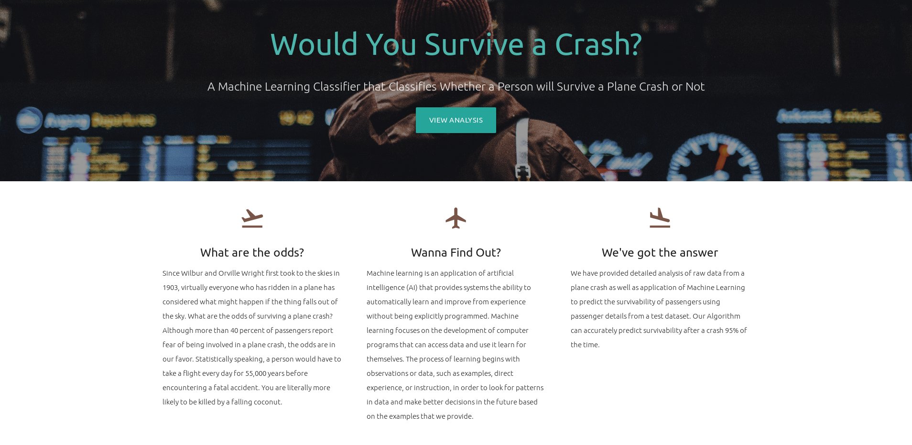

# Airplane Crash Survivability Classifier

A machine learning model which classifies whether a passenger would survive after a plane crash based on their boarding information.

Datasets provided by Konnexions, IT Society of KIIT.
Model based on Logistic Regression
F Score = 0.95

The documented code is hosted here:
[https://chronarchitect.github.io/KNX-Project/](https://chronarchitect.github.io/KNX-Project/)

#### - Developers

- [Aniket Das](https://github.com/chronarchitect)
- [Sanat Singh](https://github.com/sanatsingh)

#### - Help Recieved

- [Biswajeet Sahoo](https://github.com/asterlanghorn)
- Akarsh Srivastava